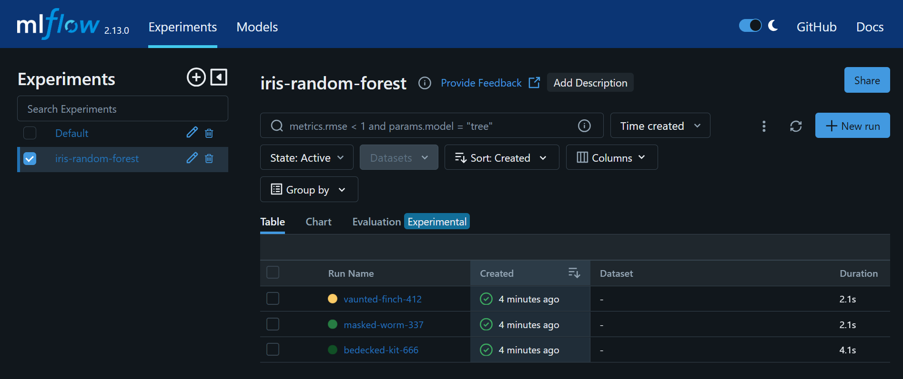
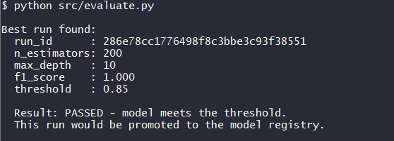
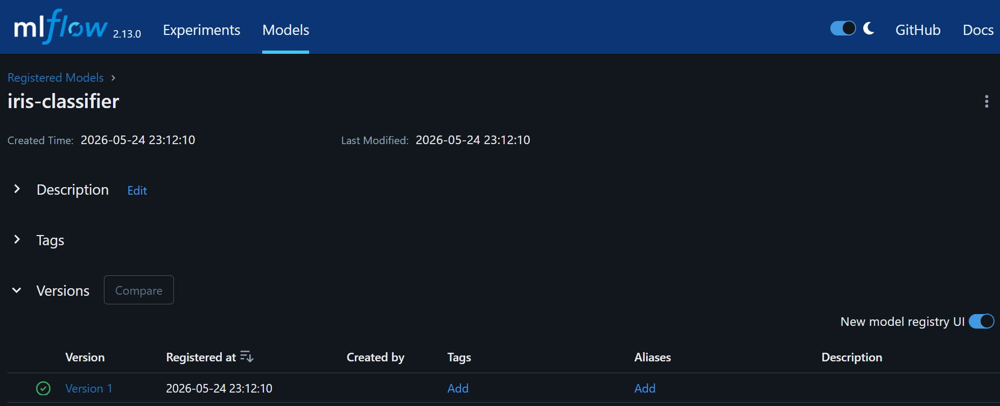
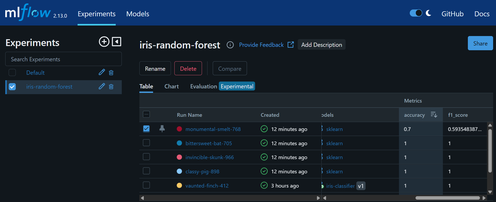
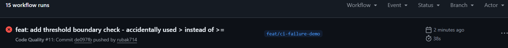
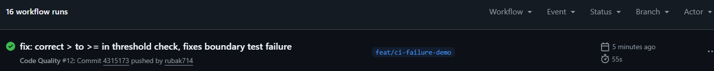

# 🤖 Azure MLOps and LLMOps Platform

---

> Most MLOps tutorials show you how to log a metric with MLflow and call it a pipeline.
> This one is different.
> Every design decision is documented. Every real error that came up is written down with the fix.
> The CI pipeline went red on the first run and the fix is in the commit history.
> This is not a walkthrough of what MLflow can do.
> This is what actually happened when building **a real MLOps pipeline** from scratch as someone learning it for the first time.

---

I have been working with Terraform since last year through assigned company tasks covering GCP, Kubernetes, and Helm. More recently I built a full Azure data platform from scratch using Databricks, Key Vault, and ADLS Gen2. I also have an ML background from my thesis on missing data imputation using GANs, VAEs, DAEs, and statistical methods on DHS health survey data, plus supervised learning from university research and coursework.

**This repo is the next step:** taking what I know about infrastructure and ML and learning how to operationalize models and LLMs properly on Azure. The focus is MLflow experiment tracking, a threshold-based model promotion pipeline, GitHub Actions CI, and my first hands-on work with LLMOps patterns.

I am documenting what I learn as I go, including a dedicated [LLM_LEARNING.md](./LLM_LEARNING.md) for the LLM concepts that are new to me.

**This repo is the next step:** taking what I know about infrastructure and ML and learning how to operationalize models and LLMs properly on Azure. The focus is MLflow experiment tracking, a threshold-based model promotion pipeline, GitHub Actions CI, and my first hands-on work with LLMOps patterns.

I am documenting what I learn as I go, including a dedicated [LLM_LEARNING.md](./LLM_LEARNING.md) for the LLM concepts that are new to me.

## 🔧 What this builds

- A scikit-learn training pipeline with MLflow experiment tracking across four parameter combinations including one deliberately weak run
- A threshold-based model promotion gate - `evaluate.py` checks the best run against F1 ≥ 0.85 before `register_model.py` promotes it to the MLflow registry
- GitHub Actions CI that runs flake8 and pytest on every PR and runs training and evaluation on every merge to main
- Basic prompt versioning for a text summarization task with notes on what changed between versions
- Unit tests covering threshold logic, boundary cases, data split sizes, and label alignment
- 7 real errors documented in [docs/errors_and_fixes.md](./docs/errors_and_fixes.md) as they happened

## 🔧 Dataset

This project uses the **Iris dataset** from scikit-learn's built-in datasets (`sklearn.datasets.load_iris`).

**Why Iris:**
No external files, no downloads, no storage setup needed. It loads in one line and works offline. The dataset is a standard benchmark for classification pipelines, which makes it easy for me to focus on what this project is actually about - the MLflow tracking, evaluation logic, and CI pipeline rather than data wrangling.

**What it contains:**
150 samples of iris flowers across 3 species (setosa, versicolor, virginica). Each sample has 4 numeric features: sepal length, sepal width, petal length, and petal width. The task is to predict the species from the measurements.

**What I investigated:**

- Does changing the number of trees and tree depth improve the model's F1 score?
- Does the model reach the minimum F1 score (0.85) needed to be saved to the registry?
- What happens in the pipeline when a model is too weak to be promoted?

## 🔧 How to run locally

    git clone https://github.com/rubak714/azure-mlops-llmops-platform.git
    cd azure-mlops-llmops-platform
    python -m pip install -r requirements.txt

    # run training - logs 4 runs to MLflow
    python src/train.py

    # check which run passes the threshold
    python src/evaluate.py

    # register the best run in the MLflow model registry
    python src/register_model.py

    # open the MLflow UI to see all runs
    mlflow ui

Then open `http://127.0.0.1:5000` in your browser. Go to the `iris-random-forest` experiment in the left sidebar to see all 4 runs with their parameters and metrics.

## 🔧 Project structure

    azure-mlops-llmops-platform/
    ├── .github/
    │   └── workflows/
    │       ├── code-quality.yml       # flake8 and pytest on every PR
    │       └── train-evaluate.yml     # training and evaluation on merge to main
    ├── src/
    │   ├── train.py                   # trains the model and logs runs to MLflow
    │   ├── evaluate.py                # checks the best run against the threshold
    │   └── register_model.py          # registers the model if it passes
    ├── tests/
    │   ├── test_evaluate.py           # threshold logic and boundary cases
    │   └── test_data_loading.py       # data split and shape checks
    ├── llm_experiments/
    │   ├── prompt_v1.txt              # first prompt version
    │   ├── prompt_v2.txt              # revised prompt with tighter constraints
    │   └── notes.md                   # what changed between versions
    ├── notebooks/
    │   └── ml_exploration.ipynb       # dataset exploration before writing train.py
    ├── docs/
    │   ├── architecture.md            # how the pieces connect and why
    │   └── errors_and_fixes.md        # 7 real errors hit during the build
    ├── screenshots/                   # MLflow UI, CI runs, evaluate output
    ├── LLM_LEARNING.md                # running notes on LLM concepts new to me
    └── requirements.txt

## 🔧 How the pipeline works

    src/train.py
        trains RandomForestClassifier across 4 parameter combinations
        logs parameters, accuracy, F1 score, and model artifact to MLflow
            |
            v
    src/evaluate.py
        finds the best run by F1 score in the iris-random-forest experiment
        checks whether it meets the promotion threshold of 0.85
        prints PASSED or FAILED with the run details
            |
            v
    src/register_model.py
        runs the same threshold check
        if F1 >= 0.85 → registers the model in the MLflow registry
        if F1 < 0.85  → exits without registering anything
            |
            v
    .github/workflows/train-evaluate.yml
        runs train.py and evaluate.py automatically on every merge to main
        so any change that affects model performance is visible immediately

The deliberately weak run (n_estimators=2, max_depth=1) scores around F1=0.72 and demonstrates the gate blocking a bad model. The three stronger runs all score F1=1.0 on this dataset and pass.

See [docs/architecture.md](./docs/architecture.md) for the full design decisions behind each component.

## 📸 Screenshots and diagrams

### Pipeline diagram

### MLflow experiment runs

### Evaluate output - threshold check

### Model registered in MLflow registry

### MLflow with weak model run visible

### CI pipeline - red run caught a broken test

### CI pipeline - green after fix

## 🔧 Docs and learning notes

| File | What it covers |
|---|---|
| [docs/architecture.md](./docs/architecture.md) | How the pieces connect, design decisions, and what is missing vs a production setup |
| [docs/errors_and_fixes.md](./docs/errors_and_fixes.md) | 7 real errors hit during the build with root cause and fix for each |
| [LLM_LEARNING.md](./LLM_LEARNING.md) | Running notes on LLM concepts - tokens, RAG, hallucination, LLMOps, Azure AI Foundry |
| [llm_experiments/notes.md](./llm_experiments/notes.md) | What changed between prompt v1 and v2 and what I observed |

## 🔧 Related repo

[azure-data-platform-terraform](https://github.com/rubak714/azure-data-platform-terraform) - the infrastructure layer this builds on. Covers Terraform modules for Databricks, ADLS Gen2, Key Vault, and VNet on Azure deployed to Germany West Central with a full GitHub Actions CI/CD pipeline.

## 🔧 Status

Core pipeline complete - training, evaluation, model registry, CI, tests, and LLM experiments. Next steps are LLM API integration and drift detection.